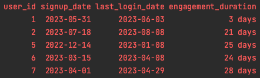
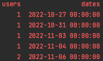
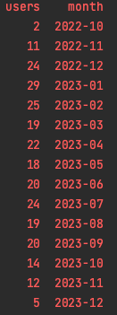
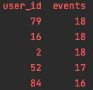
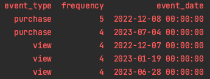
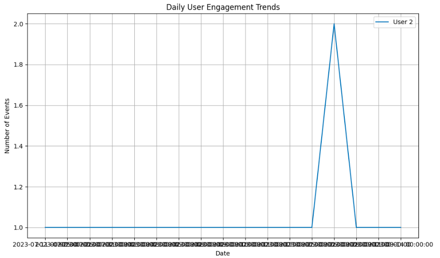
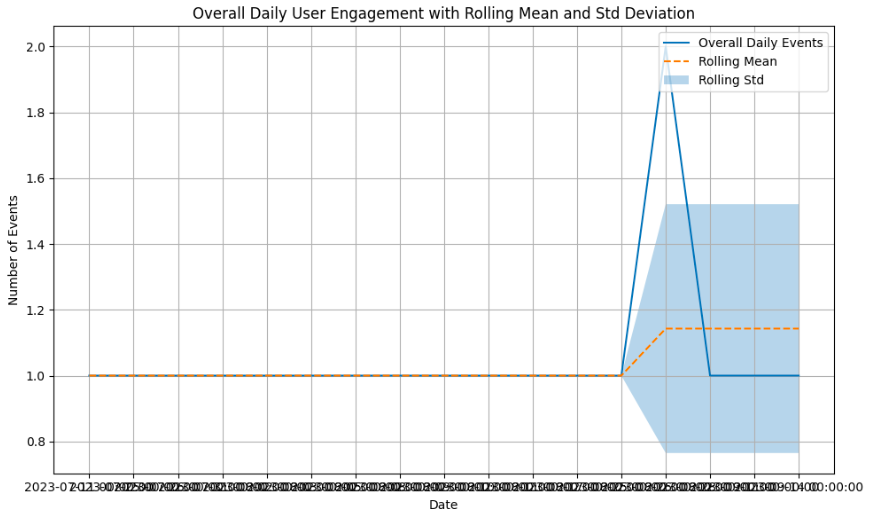
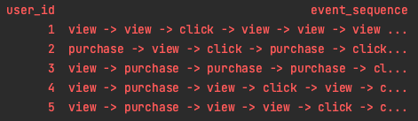
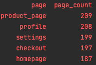

# DE-EventDriven

## Data Cleaning and Transformation

For this process we will read the data sets that are on the yaml file configuration, we can add as many as we need
I used the python pandas library in order to read the file and using the fillna('') method in order to fill missing values

For derive the new feature user's engagement duration I created the function add_engagement_duration that calculates
the new field engagement_duration using the last login date minus signup date and returns the following dataframe

## Engagement Analysis

For this process I created another function called engagement_analysis, first we need to read and create the dataframe using
the dataset for user events, I used SQL in order to obtain the values DAU, MAU, Top 5 Most Engaged User and
Most Common Event Types:

DAU:  `SELECT COUNT(DISTINCT user_id) AS users, event_date AS dates
      FROM ue_df
      GROUP BY event_date`

MAU:  `SELECT COUNT(DISTINCT user_id) AS users, strftime('%Y-%m', event_date) AS month
      FROM ue_df
      GROUP BY strftime('%Y-%m', event_date)`

Top 5 Most Engaged User: `SELECT
              user_id,
              COUNT(event_type) AS events
        FROM ue_df
        GROUP BY user_id
        ORDER BY events DESC
        LIMIT 5`

Most Common Event Types: `SELECT
              user_id,
              COUNT(event_type) AS events
        FROM ue_df
        GROUP BY user_id
        ORDER BY events DESC
        LIMIT 5`

## Timeline Analysis

For this process I created the function called timeline_analysis, in this part we need to read and create
the two datasets user_events and user_profiles and then start calculating the daily events count for each user
using SQL and for this approach we will use matplot lib in order to plot this output

Daily Event Counts for each user: `SELECT 
                   user_id,
                   COUNT(event_type) AS event_count,
                   event_date
            FROM ue_df
            GROUP BY user_id, event_date`

For this approach we can adapt the query in order to filter for the user desired and start doing an analysis for that one,
in this example I used the user_id number 2

For the next part in the timeline analysis we need to identify any patterns or anomalies in user engagement, 
such as drop-offs or spikes in activity. For this we calculated overall daily event counts for all users combined,
this aggregation gives an overview of the total events occurring each day across all users in the dataset, next 
step we need to calculate the mean and std deviation in order to understand the tendencies of the dataset and
can identify any anomalies, as we know the mean help us in order to know the typical values of the dataset and the
std deviation help us to know the amount of variation or dispersion in the dataset, a low standard deviation 
indicates that the values tend to be close to the mean, while a high standard deviation indicates that the values are
spread out over a wider range. For this exercise I used just 7 days window.

We can see that the user 2 has a normal behavior until `26/08/2023` we can see a spike and the std deviation change due to
an increment of the user events

## Behavioral Analysis

For this process I created the function called behavioral_analysis, the first step is analyze the sequence of event types
for users, for that I used SQL and created the following query:

Daily Event Counts for each user: `SELECT 
                   user_id,
                   GROUP_CONCAT(event_type, ' -> ') AS event_sequence
            FROM ue_df
            WHERE user_id = 2
            GROUP BY user_id`

The next part of this approach is determine the most popular pages in the application based on event data, I used SQL to 
obtain these values:

Most Popular Pages: `SELECT 
                   page,
                   COUNT(*) AS page_count
            FROM ue_df
            GROUP BY page
            ORDER BY page_count DESC`

